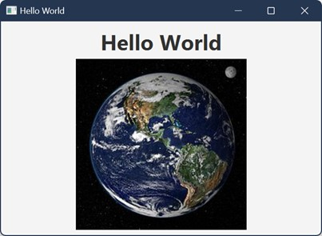

# Expected Output

The application should display a centered GUI containing:

- a large `Hello World` label
- the provided local `earth.png` image from `../assets/earth.png` shown below the label
- a `VBox`-style vertical layout

