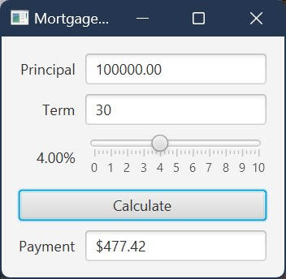

# Expected Output

The application should display a mortgage calculator GUI with:

- a principal input field
- a term-in-years input field
- an annual-interest slider
- a `Calculate` button
- a monthly payment display field

