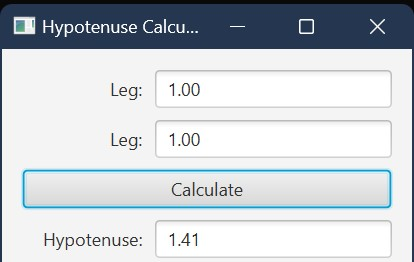

# Expected Output

The application should display a hypotenuse calculator GUI with:

- two editable leg input fields
- a `Calculate` button
- a non-editable result field for the hypotenuse
- legs reformatted to two decimal places after calculation

