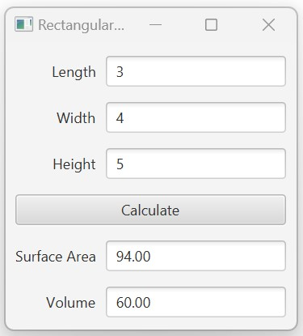

# Expected Output

The application should display a rectangular prism calculator GUI with:

- length, width, and height input fields
- a `Calculate` button
- non-editable output fields for surface area and volume

